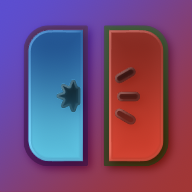

   

  <h1><b>LiveContainer</b></h1>
  
<i>An app launcher that runs iOS apps without actually installing them! </i>

<h6 align="center">

<td>

   

   <h1><b>Spotify++ v9.1.0</b></h1>
</td>

<td>

   

   <h1><b>MelonX v2.3.1</b></h1>
</td>

